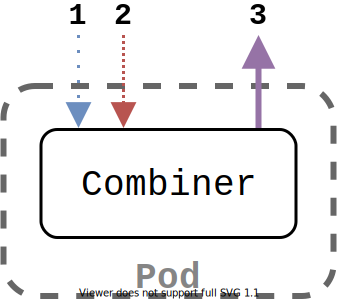

# Iterum Combiner

---

If you haven't done so already, check out the [main repository](https://github.com/iterum-provenance/iterum) with introductory material.
Additionally, if you have not done so, this package has many dependencies on the shared library called [iterum-go](https://github.com/iterum-provenance/iterum-go). It contains shared/generalized dependencies of this combiner, the [fragmenter-sidecar](https://github.com/iterum-provenance/fragmenter-sidecar) and the standard [sidecar](https://github.com/iterum-provenance/sidecar)

---

## General overview

The combiner is an application that is automatically deployed for each pipeline and acts as its sink. Since both the fragment stream and data versioning components of the system are defined by Iterum, it is possible to completely automate this process. This is why there is no need for a user-defined container to be attached. The general flow of the combiner is shown in the image below, along with a more detailed explanation.

1. For each message from the message queue
2. Download the actual data referenced in that message
3. Upload its contents as normal files into a pipeline results structure along the original versioned data set

---

## Combiner structure

The combiner itself consists of multiple smaller units wrapped up in goroutines. Each of them communicate with their dependents using channels. Most information that is communicated are the various types of `Desc` types, such as `LocalFragmentDesc`, `LocalFileDesc`, `RemoteFragmentDesc`, `RemoteFileDesc`.
The general application flow can be observed in `main.go`, though the implementation of each goroutine is somewhat more intricate. The implementation of many elements are shared and so stored in the shared `iterum-go` repo. For documentation on these see that repository. This is how the combiner links together these elements:

1. `messageq.Listener` retrieves messages from the MQ, but awaits acknowledgements for a later time
2. Parsed messages are converted into RemoteFragmentDesc that are passed on to the `DownloadManager`
3. This manager distributes the work to download instances that download all files of a fragment
4. Upon completion the now LocalFragmentDesc (since its downloaded to the disk) is passed on to `DaemonUploader`
5. This `DaemonUploader` constructs a multipart form request that uploads each of the files in the fragment to the Daemon
6. After upload the `Listener` is messages that it may now acknowledge this message
6. The `UpstreamChecker` is the routine reponsible for checking when a transformation can go down.
  It prompts the manager for whether all previous steps have completed.
  Once this returns yes, the MQListener is informed that no new messages will be posted on the queue
  This makes the Listener await the current set of messages left in the queue.
  Once all have been consumed it closes some outgoing channels except for the acknowledger
  This chains throughout the other go routines, once a routine's input channel closes it finishes up and goes down.
---

## Code documentation

The documentation of code is left to code files themselves. They have been set up to work with Godoc, which can be achieved by running `godoc` and navigating to `http://localhost:6060/pkg/github.com/iterum-provenance/combiner/`.